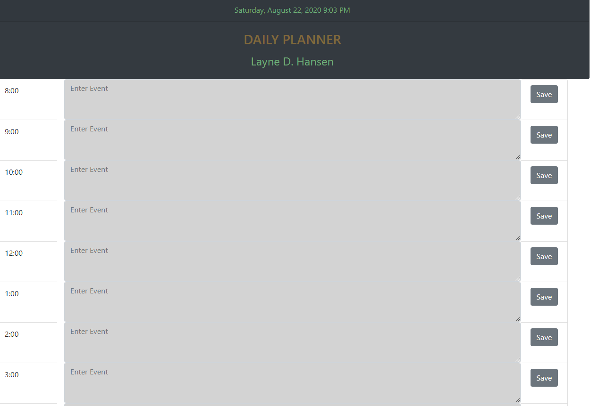

# day_planner

### WORKDAY PLANNER

### PURPOSE

The purpose of this application is to provide a text area to place tasks within a given work hour. This also allows the user to see which tasks have passed due to color coding of the text areas. Grey means the time has passed. White means it is within the current hour. Green means future time.

### REQUIREMENTS

I was required to provide a place for the user to type tasks. The text would be stored in local storage and retrieved onto the text area and stay after the page had refreshed. The color coding scheme was also required. This is a quick and easy way to see what tasks or events are set for the day, which are in the past, and which are still upcoming.

##### Screenshot

Below is a screenshot of the application.

##### URL

https://laynehansen.github.io/day_planner/

### DIFFICULTIES

This project was not as difficult as previous ones. The biggest challenge was creating functions that allowed me to reduce the amount of code. The code is much cleaner and easier to read. I was able to accomplish this by first writing a function that worked for each individual time block. With help from my TA, I was able to convert this function to a global function that affected ALL of the time blocks.

### LESSONS (TAKEN FROM PREVIOUS PROJECT)

Pseudocoding is extremely important. It is also important to get one complete element working the way it should and then copy that code over to the other boxes. After that, I took it a step further and wrote functions that affected all of the other time blocks.

### SHOUT OUTS

AJ, Jake, Chris. 

